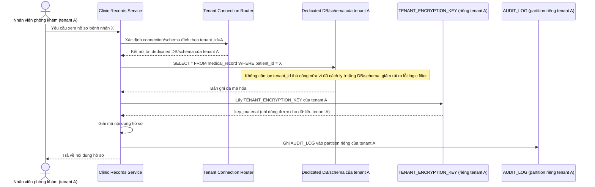

# Enhance sequence — Xem hồ sơ bệnh nhân (database/schema riêng, khóa riêng theo tenant)

Đây là **enhance**, cùng flow "Xem hồ sơ bệnh nhân" đã có ở base nhưng nay thay đổi theo yêu cầu 1 và 2 của đề bài: dữ liệu nằm trong database/schema riêng của từng tenant (không còn chỉ lọc `tenant_id` trong shared schema), và giải mã bằng khóa mã hóa riêng của chính tenant đó thay vì khóa dùng chung.

