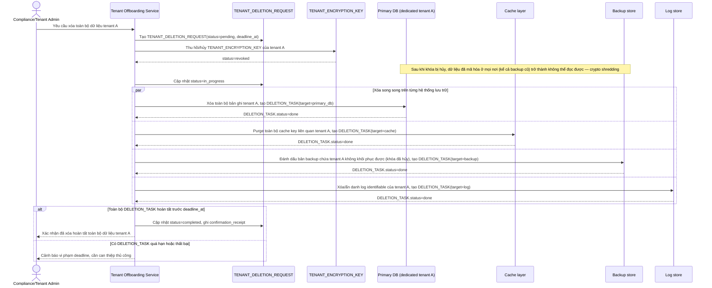

# Enhance sequence — Xóa dữ liệu triệt để của một tenant (crypto shredding)

Đây là **enhance**, flow hoàn toàn mới, phát sinh từ enhance — chưa tồn tại ở base (base không có quy trình xóa dữ liệu tenant theo yêu cầu pháp lý). Đáp ứng yêu cầu 2 và 3 của đề bài: khi phòng khám ngừng hợp tác hoặc yêu cầu quyền xóa dữ liệu, hủy khóa mã hóa riêng của tenant đó (crypto shredding) và xóa/hủy dữ liệu trên mọi hệ thống lưu trữ trong khung thời gian xác định, có xác nhận hoàn tất.

