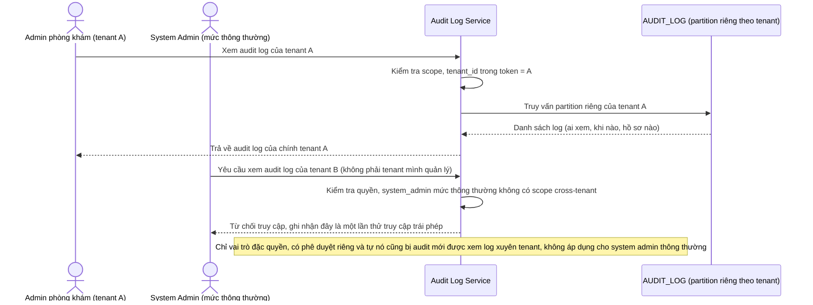

# Enhance sequence — Xem audit log (cách ly theo tenant, kể cả với system admin)

Đây là **enhance**, flow hoàn toàn mới, phát sinh từ enhance — ở base audit log được ghi nhưng chưa có flow/cơ chế nào giới hạn việc xem log theo tenant. Đáp ứng yêu cầu 4 của đề bài: audit log chi tiết, tách biệt theo tenant, và không cho tenant khác — kể cả admin hệ thống ở mức thông thường — xem được audit log của tenant khác.

