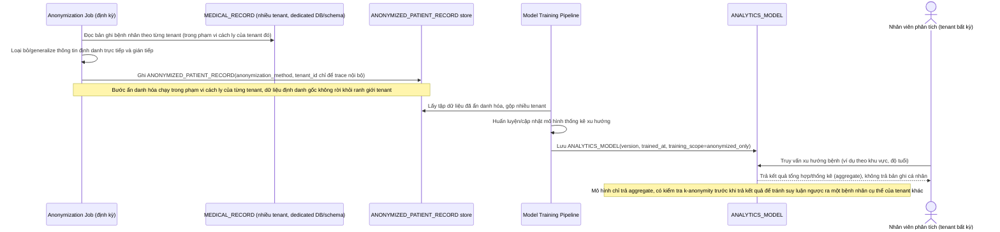

# Enhance sequence — Huấn luyện mô hình phân tích trên dữ liệu đã ẩn danh hóa

Đây là **enhance**, flow hoàn toàn mới, phát sinh từ enhance — base chưa có pipeline AI/phân tích dữ liệu tổng hợp nào. Đáp ứng yêu cầu 5 của đề bài: tính năng phân tích xu hướng bệnh chỉ được huấn luyện trên dữ liệu đã ẩn danh hóa đúng cách, và mô hình không được "nhớ" rồi lộ lại thông tin cụ thể của một bệnh nhân cho tenant khác truy vấn.

