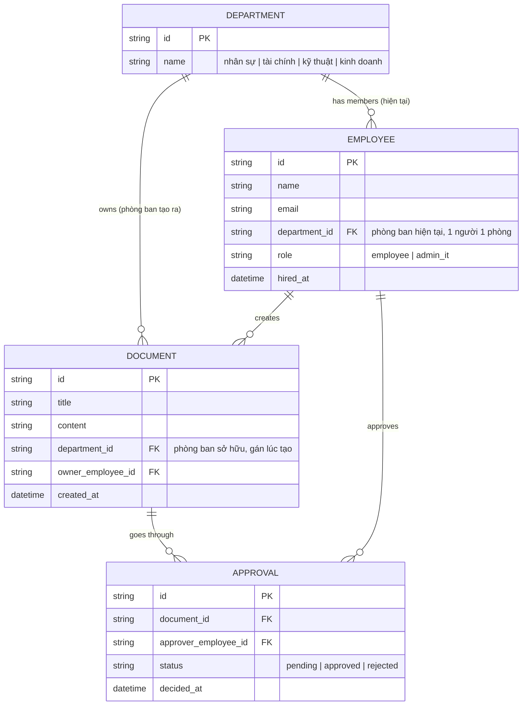

# Base ERD — Công cụ nội bộ trước khi có phân loại tài nguyên theo phòng ban

Đây là **base**: mô hình dữ liệu suy luận từ ngữ cảnh đề bài, thể hiện trạng thái hệ thống **trước khi** áp mô hình cách ly tinh vi theo phòng ban. Đề bài đối chiếu trực tiếp với "mô hình tenant=công ty độc lập" cứng nhắc — nên base được suy luận là một quy tắc cách ly đơn giản: mỗi tài liệu thuộc về đúng 1 phòng ban (`department_id` gán lúc tạo), nhân viên chỉ xem được tài liệu của phòng ban mình đang thuộc (`department_id` hiện tại), chưa phân biệt tài nguyên dùng chung toàn công ty hay chia sẻ liên phòng ban — mọi tài nguyên bị xử lý như nhau. Base **chưa có** cơ chế chuyển phòng ban có hiệu lực theo thời điểm, **chưa có** chia sẻ có thời hạn giữa các phòng, và **chưa** tách quyền vận hành hệ thống khỏi quyền đọc nội dung nghiệp vụ (admin IT mặc định có role riêng nhưng đề bài ngụ ý ranh giới này chưa rõ ràng) — những phần này là enhance.

