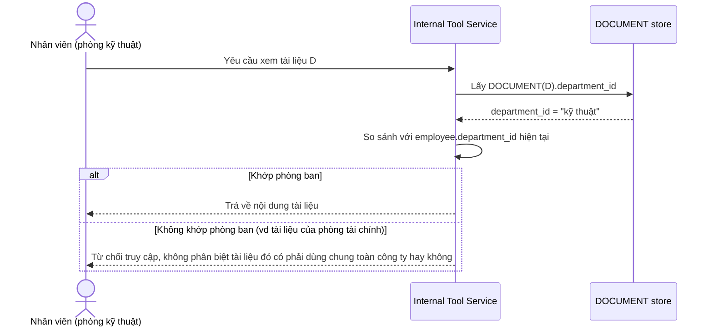

# Base sequence — Xem tài liệu (quy tắc cách ly cứng nhắc, một loại tài nguyên duy nhất)

Đây là **base**, flow "Xem tài liệu" ở trạng thái hiện tại — chỉ có đúng 1 quy tắc: `document.department_id` phải khớp `employee.department_id` hiện tại, không có ngoại lệ cho tài nguyên dùng chung hay chia sẻ liên phòng ban. Flow này liên quan mật thiết tới enhance vì yêu cầu 1 của đề bài chính là thay quy tắc cứng nhắc này bằng 3 loại tài nguyên với cơ chế kiểm tra khác nhau.

