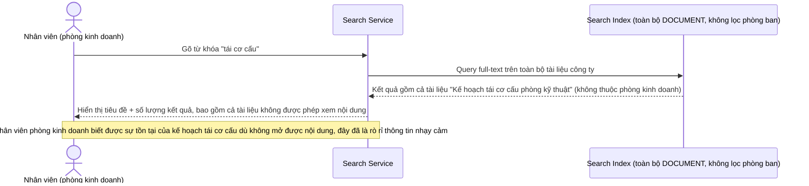

# Base sequence — Tìm kiếm tài liệu (chưa lọc theo phòng ban, lộ sự tồn tại)

Đây là **base**, flow "Tìm kiếm/gợi ý tài liệu" ở trạng thái hiện tại — index tìm kiếm không áp cùng quy tắc cách ly như flow xem tài liệu, nên kết quả tìm kiếm (tiêu đề, số lượng kết quả) trả về xuyên phòng ban dù nội dung chi tiết vẫn bị chặn nếu nhân viên click vào xem. Flow này liên quan mật thiết tới enhance vì đây chính là lỗ hổng rò rỉ mà yêu cầu 4 của đề bài nhắm tới.

