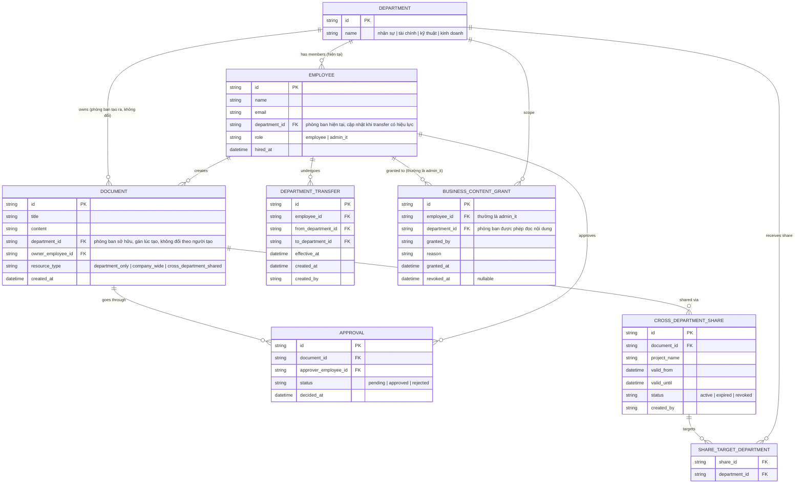

# Enhance ERD — sau khi có phân loại tài nguyên + chia sẻ có thời hạn + chuyển phòng ban

Đây là ERD **sau khi** enhance được áp dụng lên base. So với base, có 4 nhóm thay đổi/entity mới, ứng trực tiếp với 4 yêu cầu trong đề bài:

- `DOCUMENT` (sửa) — thêm `resource_type` phân biệt 3 loại: cách ly tuyệt đối theo phòng ban, dùng chung toàn công ty, chia sẻ có chọn lọc liên phòng ban.
- `DEPARTMENT_TRANSFER` (mới) — chuyển phòng ban có thời điểm hiệu lực rõ ràng, tách biệt với `EMPLOYEE.department_id` hiện tại; tài liệu cũ (`DOCUMENT.department_id`) không tự chuyển theo người.
- `BUSINESS_CONTENT_GRANT` (mới) — cấp quyền đọc nội dung nghiệp vụ tường minh, có audit, cho admin IT (mặc định admin IT không có quyền này, chỉ có quyền vận hành).
- `CROSS_DEPARTMENT_SHARE` + `SHARE_TARGET_DEPARTMENT` (mới) — chia sẻ tài liệu `cross_department_shared` cho một hoặc nhiều phòng ban cụ thể, có `valid_from`/`valid_until`, tự động hết hạn.

