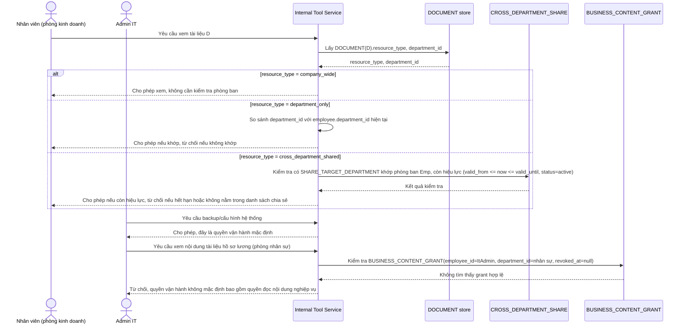

# Enhance sequence — Xem tài liệu (3 loại tài nguyên, tách quyền vận hành khỏi quyền đọc nội dung)

Đây là **enhance**, cùng flow "Xem tài liệu" đã có ở base nhưng nay thay đổi theo yêu cầu 1 và 3 của đề bài: không còn 1 quy tắc cứng nhắc duy nhất mà rẽ nhánh theo `resource_type` (cách ly tuyệt đối / dùng chung toàn công ty / chia sẻ liên phòng ban), đồng thời admin IT mặc định chỉ có quyền vận hành, muốn đọc nội dung nghiệp vụ phải có `BUSINESS_CONTENT_GRANT` tường minh.

