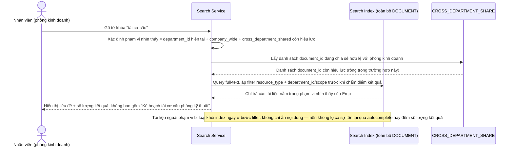

# Enhance sequence — Tìm kiếm tài liệu (kết quả lọc theo phạm vi truy cập, không lộ tồn tại)

Đây là **enhance**, cùng flow "Tìm kiếm tài liệu" đã có ở base nhưng nay thay đổi theo yêu cầu 4 của đề bài: trước khi trả kết quả (kể cả tiêu đề và số lượng), hệ thống lọc chỉ giữ lại tài liệu nằm trong phạm vi nhìn thấy được của người tìm kiếm — department_only của chính phòng ban mình, company_wide, và cross_department_shared còn hiệu lực — nên tài liệu ngoài phạm vi không xuất hiện dưới bất kỳ hình thức nào, kể cả gợi ý autocomplete.

