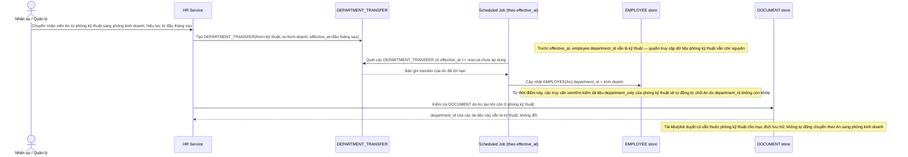

# Enhance sequence — Chuyển phòng ban có hiệu lực theo thời điểm

Đây là **enhance**, flow hoàn toàn mới, phát sinh từ enhance — base chỉ có `EMPLOYEE.department_id` tĩnh, chưa có quy trình chuyển đổi có kiểm soát thời điểm hiệu lực. Đáp ứng yêu cầu 2 của đề bài: quyền truy cập dữ liệu phòng ban cũ bị thu hồi đúng lúc chuyển đổi có hiệu lực, còn tài liệu nhân viên đã tạo khi ở phòng cũ vẫn giữ nguyên `department_id` cũ.

