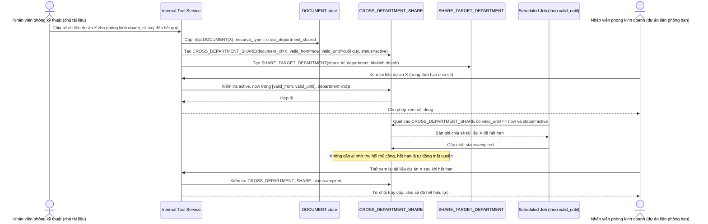

# Enhance sequence — Vòng đời chia sẻ liên phòng ban (tạo có thời hạn, tự động thu hồi)

Đây là **enhance**, flow hoàn toàn mới, phát sinh từ enhance — base không có khái niệm chia sẻ liên phòng ban, mọi tài liệu chỉ thuộc đúng 1 phòng. Đáp ứng yêu cầu 1 và 3 của đề bài: dự án liên phòng ban chia sẻ có chọn lọc một phần dữ liệu trong khoảng thời gian nhất định, và quyền này tự động thu hồi khi hết hạn thay vì phải nhớ thu hồi thủ công.

