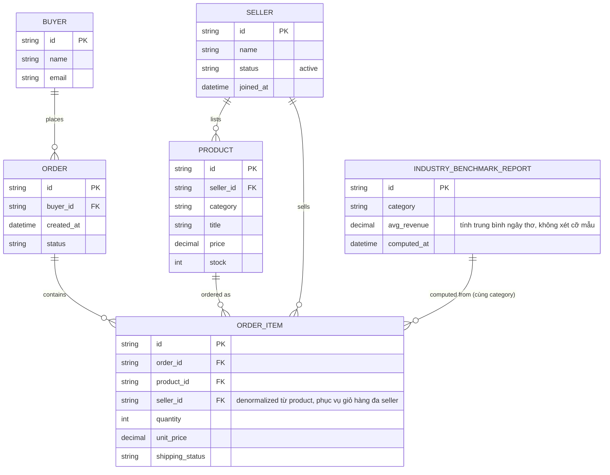

# Base ERD — Marketplace trước khi siết cách ly seller ở tầng dữ liệu

Đây là **base**: mô hình dữ liệu suy luận từ ngữ cảnh đề bài, thể hiện trạng thái hệ thống **trước khi** siết cách ly. Đề bài đối chiếu trực tiếp với việc hiện tại chỉ "ẩn nút bấm trên giao diện" — nên base được suy luận là một marketplace đã có đủ: seller, sản phẩm, đơn hàng có thể gộp nhiều seller trong cùng giỏ hàng (`ORDER_ITEM.seller_id` đã tồn tại vì đây là cấu trúc tự nhiên của giỏ hàng đa seller, không phải điều enhance mới thêm), và một báo cáo benchmark ngành đã có sẵn nhưng tính trung bình ngây thơ không xét cỡ mẫu. Base **chưa có** cơ chế enforce `seller_id` ở tầng data/query layer (chỉ dựa vào UI ẩn), **chưa có** ngưỡng mẫu tối thiểu cho benchmark, **chưa có** quy trình offboarding seller giữ lịch sử nhưng thu hồi quyền truy cập, và **chưa có** log tra cứu đơn hàng có phạm vi giới hạn cho nhân viên hỗ trợ — những phần này là enhance.

