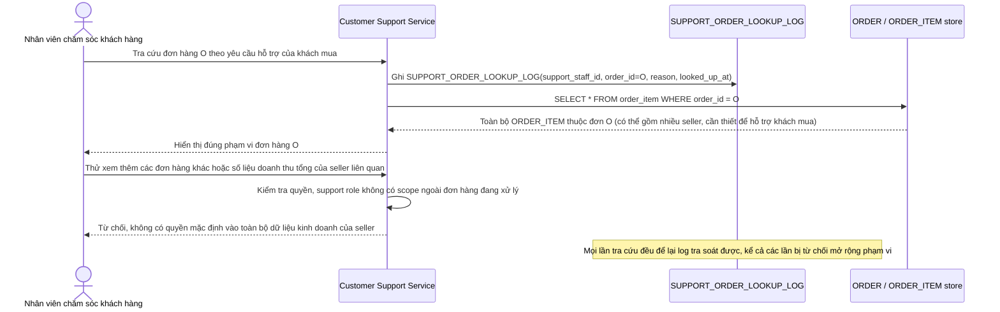

# Enhance sequence — Nhân viên chăm sóc khách hàng tra cứu đơn hàng (phạm vi giới hạn, có log)

Đây là **enhance**, flow hoàn toàn mới, phát sinh từ enhance — base không có flow riêng cho nhân viên chăm sóc khách hàng, ngụ ý trước đó không có ranh giới rõ giữa quyền hỗ trợ và toàn bộ dữ liệu kinh doanh seller. Đáp ứng yêu cầu 5 của đề bài: khi tra cứu một đơn hàng cụ thể để hỗ trợ khách mua, nhân viên chỉ thấy đúng phạm vi đơn hàng đó, không có quyền mặc định vào toàn bộ dữ liệu kinh doanh của seller liên quan, và mọi lần tra cứu đều được ghi log.

