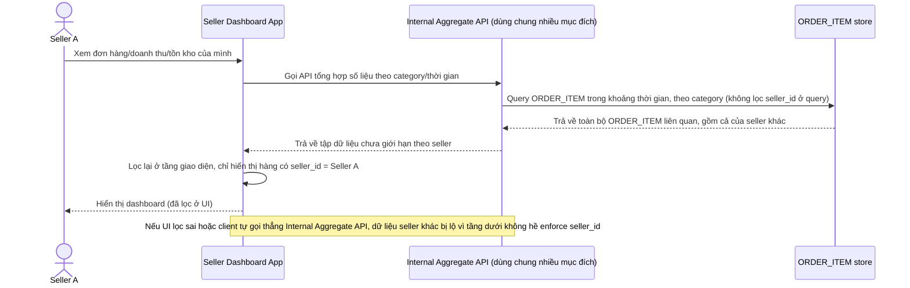

# Base sequence — Xem dashboard người bán (lọc ở tầng UI, không phải tầng data)

Đây là **base**, flow "Xem dashboard người bán" ở trạng thái hiện tại — API nội bộ dùng chung cho nhiều mục đích của nền tảng trả về dữ liệu chưa được giới hạn chặt theo `seller_id`, việc chỉ hiển thị đúng dữ liệu của seller đang đăng nhập được xử lý ở tầng giao diện. Flow này liên quan mật thiết tới enhance vì yêu cầu 1 của đề bài chính là chuyển việc giới hạn này xuống tầng thấp nhất thay vì dựa vào UI.

