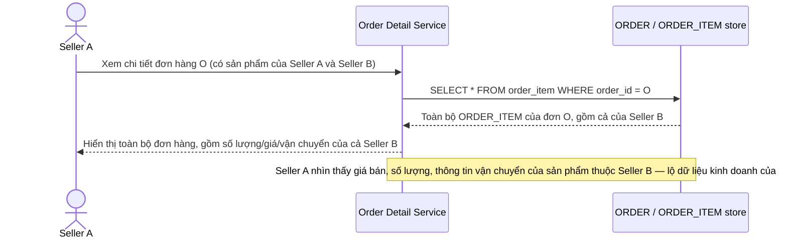

# Base sequence — Xem chi tiết đơn hàng đa seller (lộ toàn bộ đơn hàng)

Đây là **base**, flow "Xem chi tiết đơn hàng" ở trạng thái hiện tại — khi một đơn hàng có sản phẩm từ nhiều seller, seller nào mở đơn hàng cũng thấy toàn bộ chi tiết gộp, kể cả phần của seller khác. Flow này liên quan mật thiết tới enhance vì yêu cầu 2 của đề bài chính là sửa đúng lỗ hổng này.

