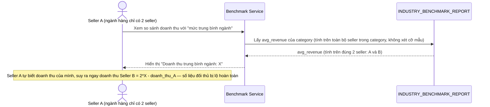

# Base sequence — Xem benchmark ngành (trung bình ngây thơ, có thể suy luận ngược)

Đây là **base**, flow "Xem báo cáo so sánh hiệu suất với trung bình ngành" ở trạng thái hiện tại — tính trung bình doanh thu toàn bộ seller trong category mà không xét số lượng seller tham gia. Flow này liên quan mật thiết tới enhance vì yêu cầu 3 của đề bài chính là chặn kiểu suy luận ngược này.

