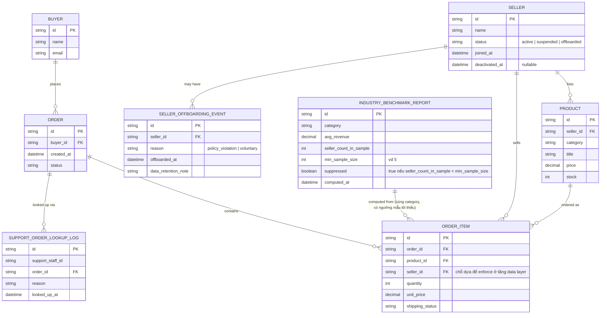

# Enhance ERD — sau khi siết cách ly seller ở tầng dữ liệu

Đây là ERD **sau khi** enhance được áp dụng lên base. So với base, có 3 nhóm thay đổi/entity mới, ứng trực tiếp với yêu cầu 3, 4, 5 trong đề bài (yêu cầu 1 và 2 là thay đổi ở tầng enforcement/query logic trên đúng các entity đã có sẵn — `ORDER_ITEM.seller_id` vẫn là chỗ dựa để lọc, không cần entity mới):

- `SELLER` (sửa) — mở rộng `status` thêm `suspended | offboarded` và `deactivated_at`, phục vụ yêu cầu 4.
- `INDUSTRY_BENCHMARK_REPORT` (sửa) — thêm `seller_count_in_sample`, `min_sample_size`, `suppressed` để chặn suy luận ngược khi cỡ mẫu quá nhỏ (yêu cầu 3), đồng thời vẫn tính đúng khi có seller đã offboard (yêu cầu 4).
- `SELLER_OFFBOARDING_EVENT` (mới) — ghi nhận lý do và thời điểm seller rời sàn, phục vụ thu hồi quyền truy cập trong khi giữ lại dữ liệu lịch sử cho hỗ trợ khách hàng/pháp lý.
- `SUPPORT_ORDER_LOOKUP_LOG` (mới) — log mọi lần nhân viên chăm sóc khách hàng tra cứu một đơn hàng cụ thể, phục vụ yêu cầu 5.

