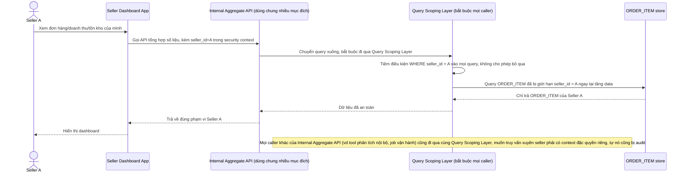

# Enhance sequence — Xem dashboard người bán (enforce seller_id ở tầng data layer)

Đây là **enhance**, cùng flow "Xem dashboard người bán" đã có ở base nhưng nay thay đổi theo yêu cầu 1 của đề bài: `seller_id` được enforce ngay tại tầng data/query layer — kể cả Internal Aggregate API dùng chung cho nhiều mục đích khác của nền tảng — thay vì chỉ lọc ở UI như base.

