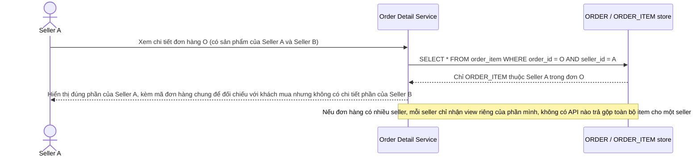

# Enhance sequence — Xem chi tiết đơn hàng đa seller (chỉ thấy phần của mình)

Đây là **enhance**, cùng flow "Xem chi tiết đơn hàng" đã có ở base nhưng nay thay đổi theo yêu cầu 2 của đề bài: mỗi seller tham gia một đơn hàng chỉ xem được `ORDER_ITEM` (số lượng, giá, vận chuyển) thuộc về sản phẩm của chính mình, không thấy toàn bộ đơn hàng gộp như base.

