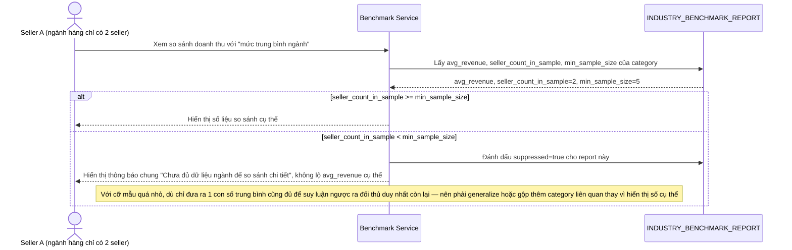

# Enhance sequence — Xem benchmark ngành (chặn suy luận ngược khi cỡ mẫu nhỏ)

Đây là **enhance**, cùng flow "Xem báo cáo so sánh hiệu suất với trung bình ngành" đã có ở base nhưng nay thay đổi theo yêu cầu 3 của đề bài: trước khi trả số liệu so sánh cụ thể, hệ thống kiểm tra `seller_count_in_sample` so với `min_sample_size`, nếu ngành hàng quá ít seller thì không tiết lộ số liệu chi tiết để tránh suy luận ngược ra đối thủ cụ thể.

