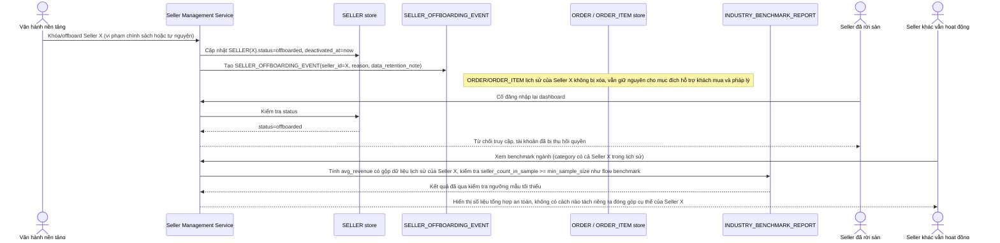

# Enhance sequence — Seller offboarding (thu hồi quyền, giữ lịch sử, không lộ qua báo cáo tổng hợp)

Đây là **enhance**, flow hoàn toàn mới, phát sinh từ enhance — base không có quy trình xử lý khi seller ngừng hoạt động, chỉ có `status = active` cố định. Đáp ứng yêu cầu 4 của đề bài: dữ liệu lịch sử đơn hàng vẫn giữ cho hỗ trợ khách hàng/pháp lý, seller đã rời sàn mất quyền truy cập, và các seller khác không vô tình thấy dữ liệu của seller đã rời qua báo cáo tổng hợp toàn nền tảng.

