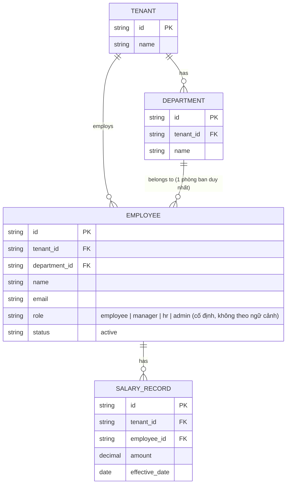

# Base ERD — SaaS payroll trước khi có cách ly 2 lớp

Đây là **base**: mô hình dữ liệu suy luận từ ngữ cảnh đề bài, thể hiện trạng thái hệ thống **trước khi** có lớp cách ly nội bộ theo vai trò. Đề bài nói rõ "ngoài cách ly giữa các tenant, flow còn phải xử lý cách ly trong nội bộ một tenant" — nên base được suy luận là một SaaS payroll đã có cách ly tenant chuẩn (mỗi công ty khách hàng tách theo `tenant_id`), có nhân viên/phòng ban/bản ghi lương cơ bản với 1 vai trò cố định mỗi người, nhưng **bên trong cùng 1 tenant thì chưa cách ly theo vai trò** — bất kỳ nhân viên nào của công ty cũng có thể xem lương của đồng nghiệp khác trong cùng công ty. Base **chưa có** vai trò theo ngữ cảnh phòng ban (1 người 1 vai trò cố định), **chưa có** bảo vệ báo cáo tổng hợp khỏi suy luận ngược, **chưa có** quy trình offboarding giữ ranh giới tenant, và **chưa có** audit log truy cập lương — những phần này là enhance.

