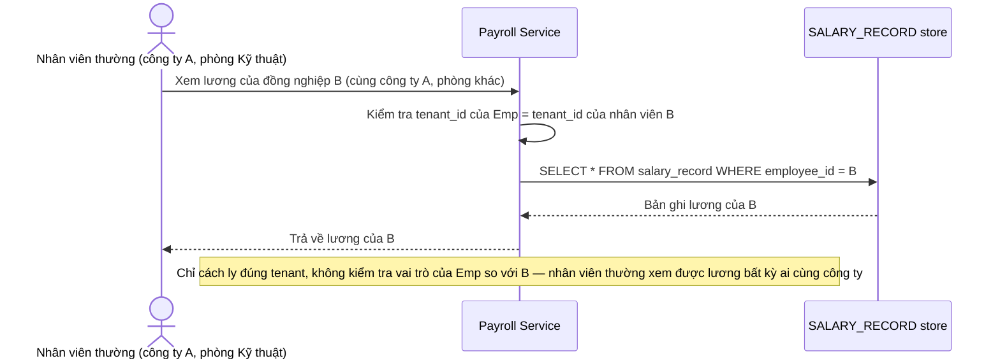

# Base sequence — Xem lương (chỉ cách ly tenant, chưa cách ly nội bộ)

Đây là **base**, flow "Xem lương nhân viên" ở trạng thái hiện tại — chỉ kiểm tra `tenant_id` khớp (đúng công ty), sau đó cho phép xem lương bất kỳ đồng nghiệp nào trong cùng công ty mà không xét vai trò của người xem. Flow này liên quan mật thiết tới enhance vì yêu cầu 1 của đề bài chính là thêm lớp cách ly nội bộ theo vai trò còn thiếu ở đây.

