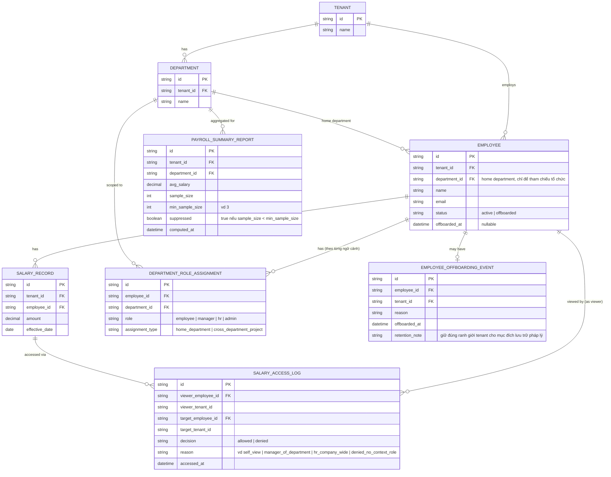

# Enhance ERD — sau khi có cách ly 2 lớp (tenant + vai trò theo ngữ cảnh)

Đây là ERD **sau khi** enhance được áp dụng lên base. So với base, có 4 nhóm thay đổi/entity mới, ứng trực tiếp với 4 yêu cầu trong đề bài:

- `DEPARTMENT_ROLE_ASSIGNMENT` (mới, thay cho `EMPLOYEE.role` cố định) — vai trò được gắn theo từng ngữ cảnh phòng ban, cho phép 1 người có vai trò khác nhau ở các phòng ban khác nhau (vd quản lý phòng A, chỉ là thành viên dự án liên phòng ban B).
- `PAYROLL_SUMMARY_REPORT` (mới) — báo cáo tổng hợp có `sample_size`/`min_sample_size`/`suppressed` để chặn suy luận ngược khi phòng ban chỉ có 1 người.
- `EMPLOYEE` (sửa) + `EMPLOYEE_OFFBOARDING_EVENT` (mới) — mở rộng `status` thêm `offboarded`, ghi nhận thời điểm và lý do nghỉ việc, dữ liệu vẫn giữ đúng ranh giới `tenant_id` cũ.
- `SALARY_ACCESS_LOG` (mới) — audit chi tiết mọi lần truy cập lương, ai xem, khi nào, tenant nào xem tenant nào.

