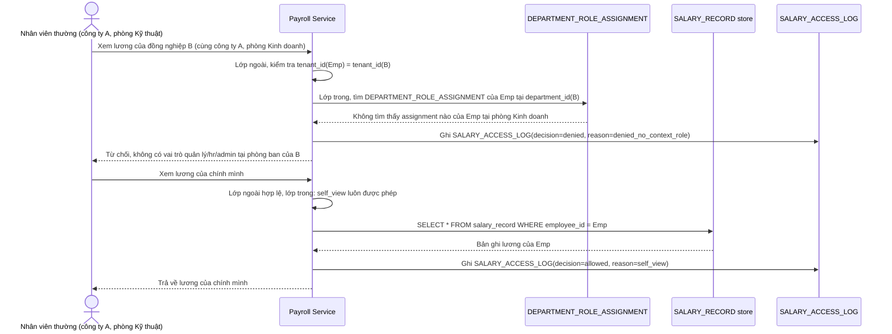

# Enhance sequence — Xem lương (cách ly 2 lớp: tenant + vai trò, có audit log)

Đây là **enhance**, cùng flow "Xem lương nhân viên" đã có ở base nhưng nay thay đổi theo yêu cầu 1 và 5 của đề bài: sau khi qua lớp ngoài (tenant_id khớp), phải qua thêm lớp trong kiểm tra vai trò của người xem đối với người bị xem (tự xem, quản lý đúng phòng ban, HR/admin công ty), và mọi lần truy cập đều được ghi log chi tiết.

