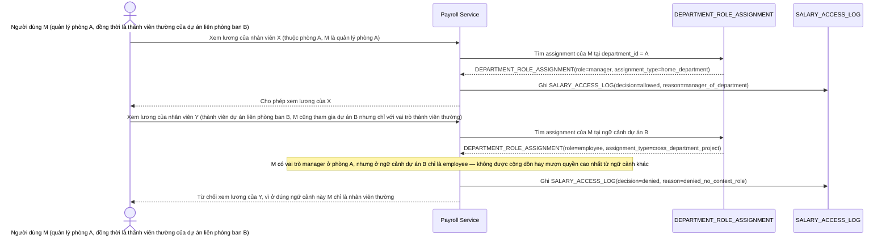

# Enhance sequence — Một người có vai trò khác nhau theo từng ngữ cảnh phòng ban

Đây là **enhance**, flow hoàn toàn mới, phát sinh từ enhance — base gán 1 vai trò cố định cho mỗi người nên không thể diễn tả trường hợp này. Đáp ứng yêu cầu 2 của đề bài: quyền xem dữ liệu phải tính đúng theo ngữ cảnh cụ thể (phòng ban nào), không cấp nhầm quyền cao nhất của người đó cho mọi ngữ cảnh.

