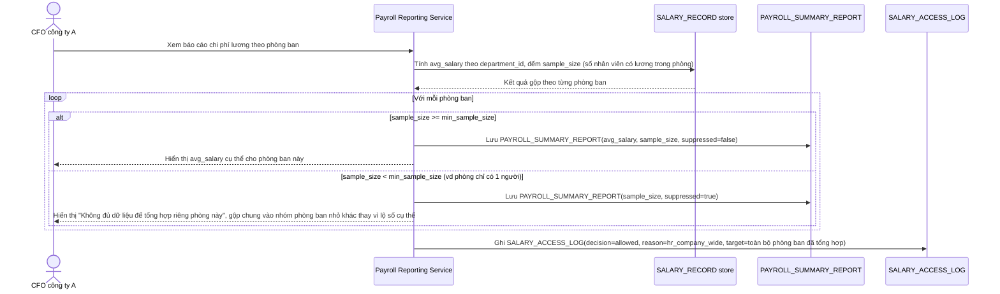

# Enhance sequence — Báo cáo tổng hợp chi phí lương (chặn suy luận ngược khi phòng ban quá nhỏ)

Đây là **enhance**, flow hoàn toàn mới, phát sinh từ enhance — base chưa có báo cáo tổng hợp nào ở tầng công ty. Đáp ứng yêu cầu 3 của đề bài: báo cáo lương trung bình theo phòng ban cho CFO không được vô tình lộ đúng lương của một cá nhân khi phòng ban đó chỉ có 1 người.

