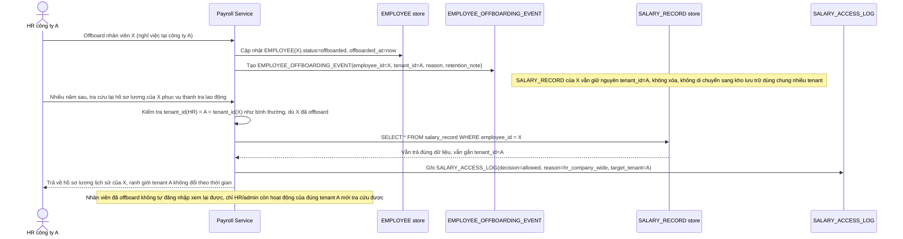

# Enhance sequence — Offboarding nhân viên, giữ đúng ranh giới tenant

Đây là **enhance**, flow hoàn toàn mới, phát sinh từ enhance — base không có quy trình offboarding, chỉ có `status = active` cố định. Đáp ứng yêu cầu 4 của đề bài: khi công ty khách hàng offboard nhân viên, dữ liệu lương/hồ sơ vẫn phải giữ cách ly đúng theo tenant đó cho mục đích lưu trữ pháp luật lao động, không bị gộp lẫn hay mất ranh giới tenant theo thời gian.

