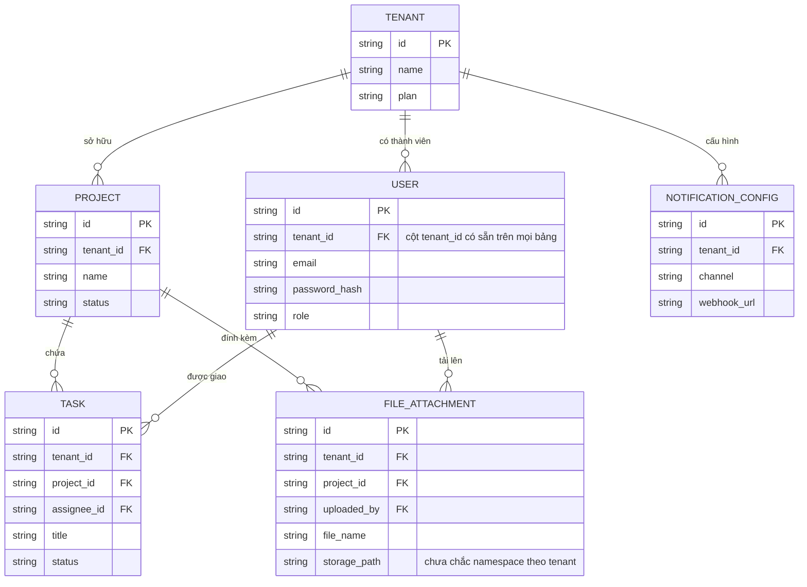

# Base ERD — SaaS quản lý dự án multi-tenant, shared schema chưa được siết isolation

Đây là **base**: mô hình dữ liệu suy luận từ ngữ cảnh đề bài. Đề bài mô tả rõ hệ thống đã theo mô hình shared schema — mọi bảng đều có sẵn cột `tenant_id` để phân biệt dữ liệu giữa các tenant. Vì vậy base **đã có** các entity cốt lõi của 1 SaaS quản lý dự án (Tenant, User, Project, Task, File đính kèm, cấu hình thông báo) với cột `tenant_id` trên từng bảng — nhưng cột này mới chỉ tồn tại ở tầng dữ liệu, **chưa có** cơ chế nào đảm bảo mọi query đều tự động lọc đúng theo nó (không có middleware/ORM enforce, không có row-level security, không có test tự động, không có cơ chế impersonation có kiểm soát, background job cũng chưa chắc tôn trọng ranh giới tenant). Đó chính là khoảng trống mà enhance lấp vào.

