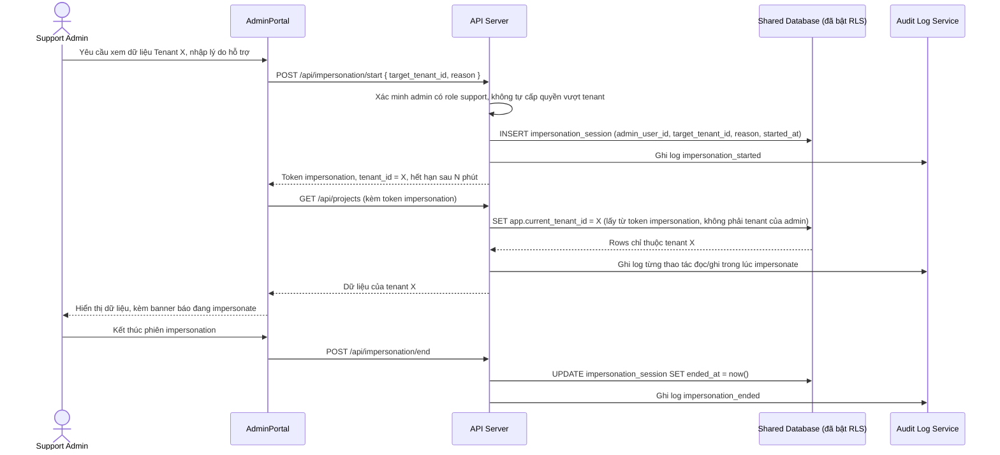

# Enhance sequence — Admin impersonation

Đây là **enhance**, flow hoàn toàn mới so với base — nhân viên support/admin nội bộ cần xem dữ liệu của 1 tenant cụ thể để hỗ trợ, thông qua 1 phiên impersonation có kiểm soát (có lý do, có thời hạn) thay vì dùng chung 1 quyền truy cập không giới hạn tenant. Mọi hành động trong phiên đều được ghi vào audit log, đúng yêu cầu đề bài.

