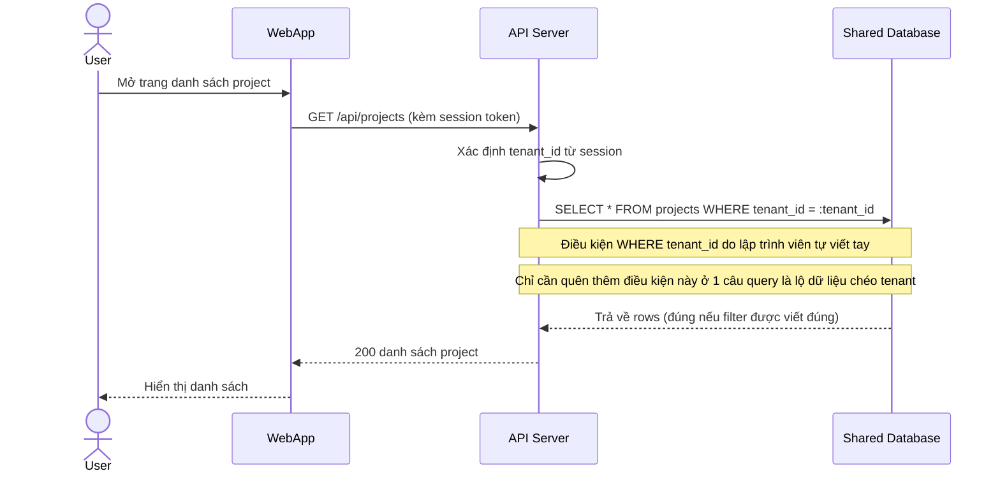

# Base sequence — List projects

Đây là **base**, flow "Đọc danh sách project của tenant hiện tại" — đại diện cho mọi query đọc/ghi dữ liệu thông thường trong hệ thống. Chọn flow này vì nó là ví dụ điển hình cho vấn đề đề bài nêu: điều kiện lọc `tenant_id` được thêm thủ công ở tầng application code, phụ thuộc hoàn toàn vào việc lập trình viên nhớ viết đúng ở từng câu query — đây chính là rủi ro mà enhance phải loại bỏ.

