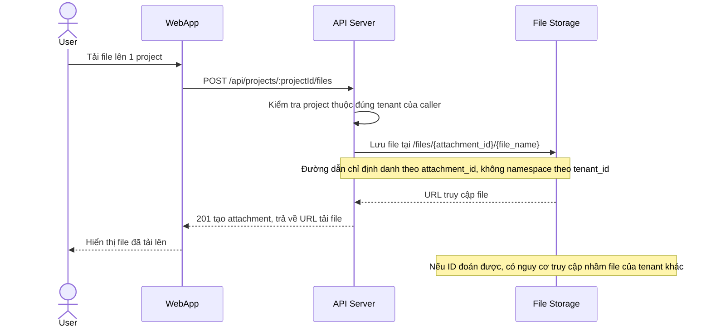

# Base sequence — Upload file

Đây là **base**, flow "Tải file đính kèm lên project" — đại diện cho nhóm tài nguyên dùng chung giữa nhiều tenant nhưng cần cấu hình riêng mà đề bài nhắc tới. Chọn flow này vì storage path/URL truy cập file ở base chỉ định danh bằng `attachment_id`, chưa gắn chặt với tenant — nếu ID này đoán được thì có nguy cơ truy cập chéo tenant.

