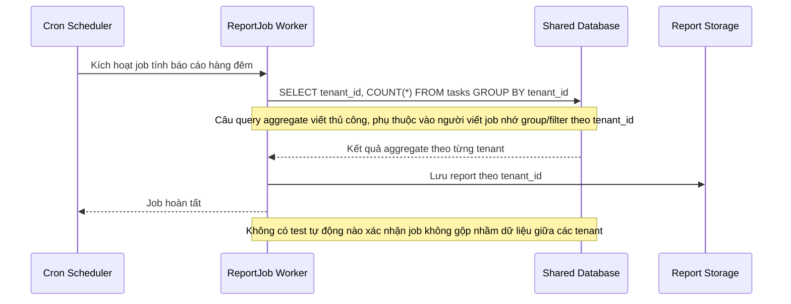

# Base sequence — Generate report job

Đây là **base**, flow "Background job tính báo cáo tổng hợp định kỳ" — đại diện cho nhóm thao tác nền (background job/cron) mà đề bài yêu cầu phải tôn trọng ranh giới tenant. Chọn flow này vì đây đúng là ví dụ đề bài nêu: 1 job tính báo cáo có nguy cơ gộp nhầm dữ liệu nhiều tenant vào 1 kết quả chung nếu câu query aggregate viết thiếu group/filter theo tenant_id.

