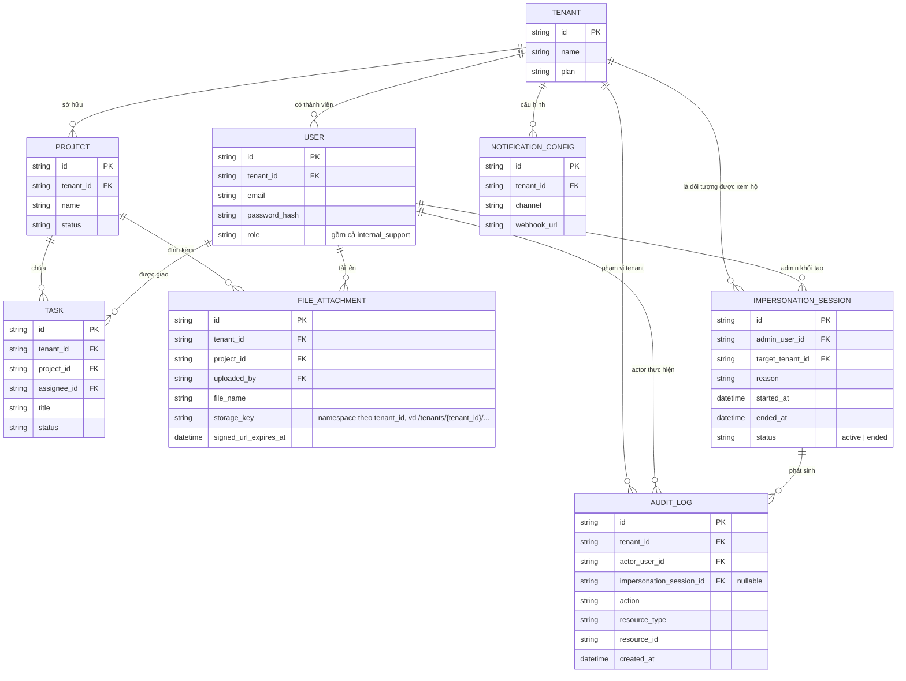

# Enhance ERD — Siết isolation, thêm impersonation có kiểm soát và audit log

Đây là ERD **sau khi** enhance được áp dụng lên base. Các entity nghiệp vụ (Tenant, User, Project, Task, File, Notification Config) giữ nguyên cấu trúc — điểm khác biệt nằm ở việc `tenant_id` trên các bảng này nay được enforce ở tầng thấp nhất (middleware/ORM tự động filter hoặc row-level security ở database) thay vì trông chờ code thủ công. So với base, có 2 nhóm entity mới, ứng trực tiếp với 2 yêu cầu còn lại trong đề bài:

- `IMPERSONATION_SESSION` (mới) — ghi nhận phiên nhân viên support/admin nội bộ "xem hộ" dữ liệu của 1 tenant cụ thể, có lý do, thời gian bắt đầu/kết thúc, thay vì dùng chung 1 quyền truy cập không giới hạn tenant.
- `AUDIT_LOG` (mới) — ghi log đầy đủ mọi hành động xảy ra trong lúc impersonate, cũng như các thao tác nhạy cảm khác, có thể truy vết về đúng actor và tenant liên quan.

`FILE_ATTACHMENT.storage_path` cũng đổi từ định danh theo `attachment_id` sang `storage_key` namespace theo `tenant_id`, và có thêm hạn dùng cho signed URL — khớp với yêu cầu "đường dẫn lưu trữ và khóa truy cập phải gắn chặt với tenant".

