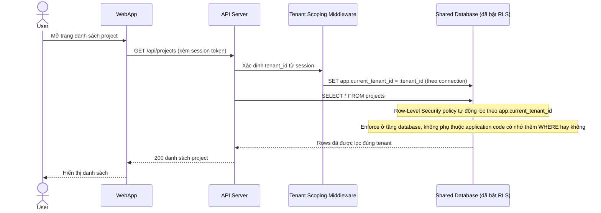

# Enhance sequence — List projects

Đây là **enhance**, flow "Đọc danh sách project của tenant hiện tại". So với base, điều kiện lọc `tenant_id` không còn do lập trình viên tự viết trong từng câu query — middleware tự động gán tenant context cho session, và database enforce bằng row-level security, nên dù application code có quên thêm điều kiện thì dữ liệu chéo tenant vẫn không thể lộ ra.

