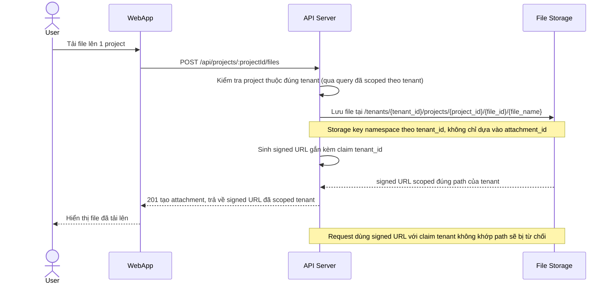

# Enhance sequence — Upload file

Đây là **enhance**, flow "Tải file đính kèm lên project". So với base, storage key không còn định danh chỉ bằng `attachment_id` mà được namespace theo `tenant_id` ngay trong đường dẫn lưu trữ, và signed URL sinh ra gắn với claim tenant — biết đúng file id nhưng sai tenant vẫn không truy cập được.

