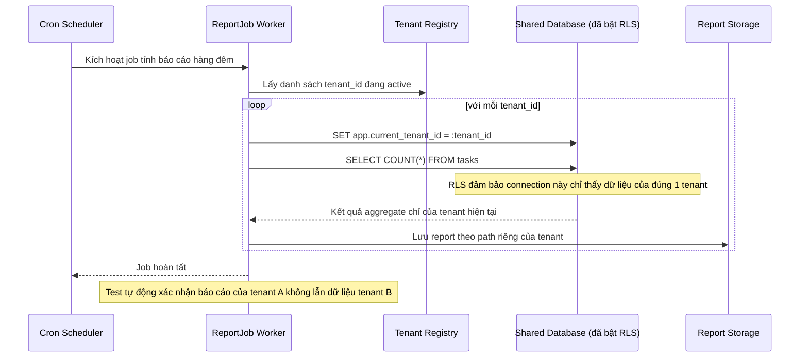

# Enhance sequence — Generate report job

Đây là **enhance**, flow "Background job tính báo cáo tổng hợp định kỳ". So với base, job không còn chạy 1 câu aggregate chung cho toàn bộ dữ liệu rồi group theo tenant_id — mà lặp qua từng tenant, thiết lập tenant context cho từng connection trước khi query, để row-level security đảm bảo mỗi vòng lặp chỉ thấy đúng dữ liệu của 1 tenant.

