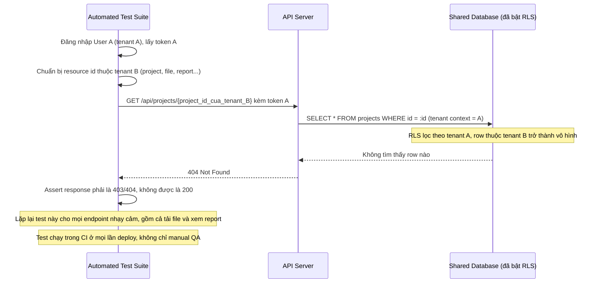

# Enhance sequence — Cross-tenant access test

Đây là **enhance**, flow hoàn toàn mới so với base — test tự động cố tình dùng token của tenant A để truy cập tài nguyên của tenant B qua các endpoint quan trọng, đảm bảo luôn bị chặn 403/404. Đây chính là yêu cầu "viết test tự động, không chỉ manual test" trong đề bài, chạy trong CI trên mọi lần deploy chứ không chỉ dựa vào việc UI không hiển thị link.

