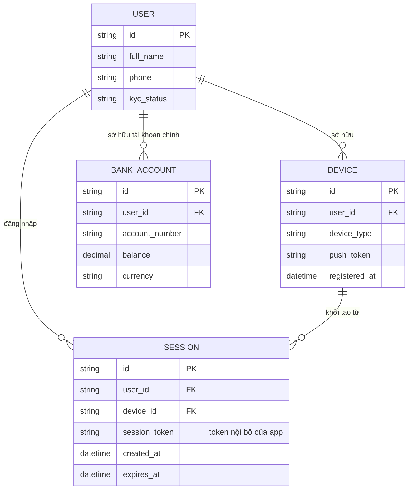

# Base ERD — App ngân hàng số trước khi có liên kết Open Banking qua BFF

Đây là **base**: mô hình dữ liệu suy luận từ ngữ cảnh đề bài. Đề bài nói tới việc "hiển thị tổng hợp số dư nhiều ngân hàng" qua liên kết Open Banking — để câu này có nghĩa, base phải đã có sẵn 1 app ngân hàng số hoạt động độc lập: user đăng nhập được, có thiết bị di động đăng ký, có session nội bộ, và có tài khoản ngân hàng chính của chính hệ thống này với số dư hiển thị được. Base **chưa có** khái niệm liên kết ngân hàng đối tác qua OAuth, chưa có PKCE, chưa có BFF đóng vai trò trung gian giữ token hộ, chưa có audit trail cho việc liên kết — tất cả đều là phần enhance.

