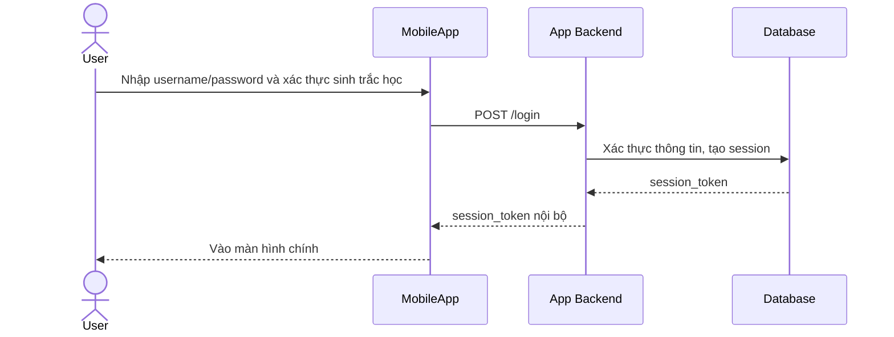

# Base sequence — Login

Đây là **base**, flow "Đăng nhập vào app ngân hàng số" — tiền đề bắt buộc cho enhance, vì mọi thao tác liên kết ngân hàng đối tác (enhance) đều cần user đã có session nội bộ hợp lệ trước khi bắt đầu. Chọn flow này để làm rõ mobile app vốn đã có cơ chế session token nội bộ riêng của mình, độc lập với bất kỳ ngân hàng đối tác nào.

