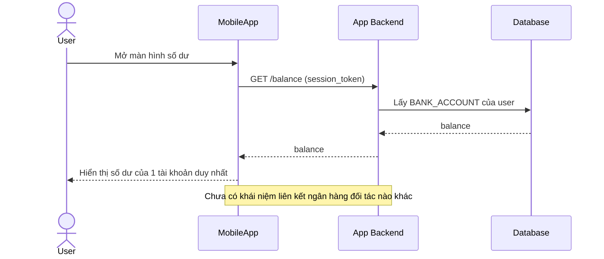

# Base sequence — View balance

Đây là **base**, flow "Xem số dư tài khoản" — chọn flow này vì đây chính là flow sẽ bị enhance tác động trực tiếp: ở base chỉ hiển thị số dư của 1 tài khoản duy nhất (tài khoản chính tại chính ngân hàng này), chưa có khái niệm tổng hợp số dư từ nhiều ngân hàng liên kết.

