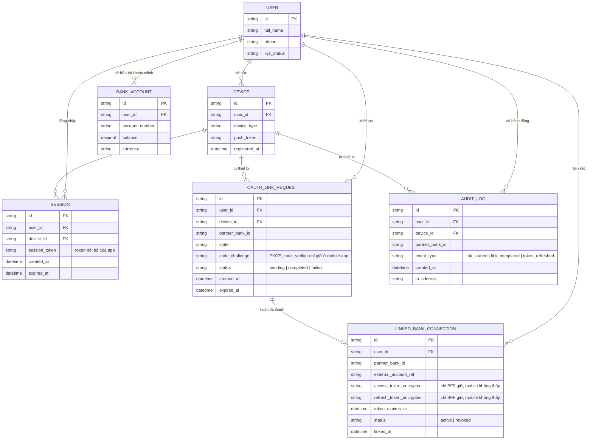

# Enhance ERD — Thêm liên kết Open Banking qua BFF với PKCE và audit trail

Đây là ERD **sau khi** enhance được áp dụng lên base. Các entity gốc (User, Device, Session, BankAccount) giữ nguyên. So với base, có 3 nhóm entity mới, ứng trực tiếp với các yêu cầu trong đề bài:

- `OAUTH_LINK_REQUEST` (mới) — theo dõi 1 phiên liên kết đang diễn ra: `state` và `code_challenge` (PKCE) được BFF lưu tạm để đối chiếu khi partner bank redirect trở lại, đồng thời map đúng về `device_id` đã khởi tạo để xử lý deep link/universal link.
- `LINKED_BANK_CONNECTION` (mới) — lưu access_token/refresh_token của từng ngân hàng đã liên kết **chỉ ở phía BFF**, mobile app không bao giờ thấy các token này.
- `AUDIT_LOG` (mới) — ghi nhận ai liên kết ngân hàng nào, khi nào, từ thiết bị nào, đáp ứng yêu cầu compliance Open Banking.

