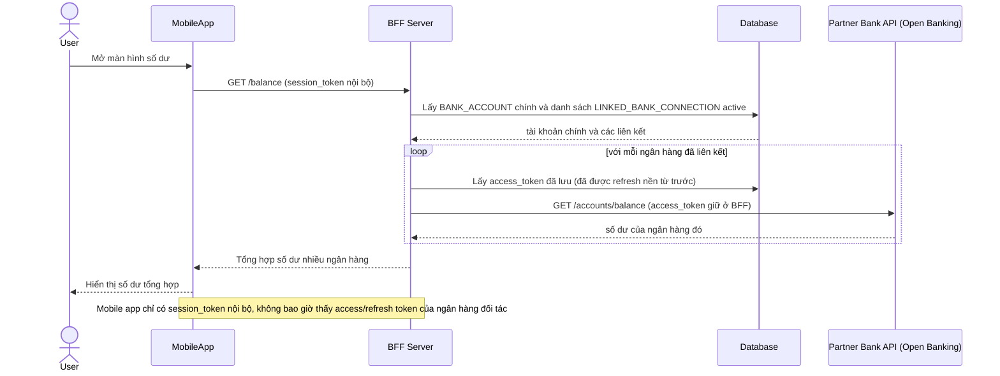

# Enhance sequence — View balance

Đây là **enhance**, flow "Xem số dư tài khoản". So với base, BFF không chỉ trả về số dư tài khoản chính mà còn lặp qua các `LINKED_BANK_CONNECTION` đang active, dùng access_token đã lưu (được refresh nền sẵn) để gọi API ngân hàng đối tác và tổng hợp số dư — mobile app vẫn chỉ thấy session_token nội bộ, không bao giờ chạm vào token của ngân hàng đối tác.

