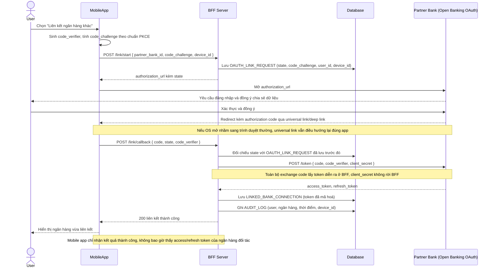

# Enhance sequence — Link bank account

Đây là **enhance**, flow hoàn toàn mới so với base — user liên kết 1 ngân hàng đối tác qua Open Banking OAuth. Đây là flow trung tâm của enhance, thể hiện đầy đủ 4 yêu cầu: authorization code exchange chỉ diễn ra ở BFF, PKCE sinh ở mobile app, redirect quay lại đúng app qua deep link/universal link, và ghi audit trail đầy đủ.

