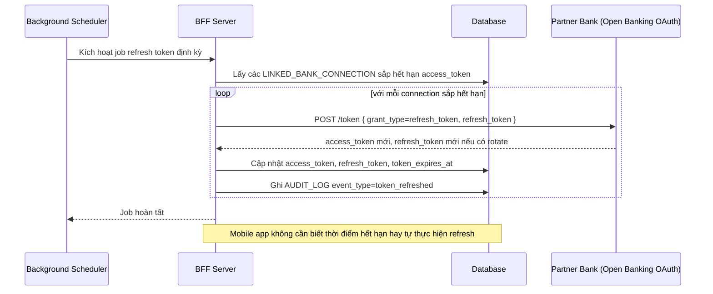

# Enhance sequence — Background token refresh

Đây là **enhance**, flow hoàn toàn mới so với base — BFF tự refresh refresh_token của từng ngân hàng liên kết trước khi access_token hết hạn, chạy nền định kỳ. Đáp ứng yêu cầu "mobile app không cần biết thời điểm hết hạn" trong đề bài.

