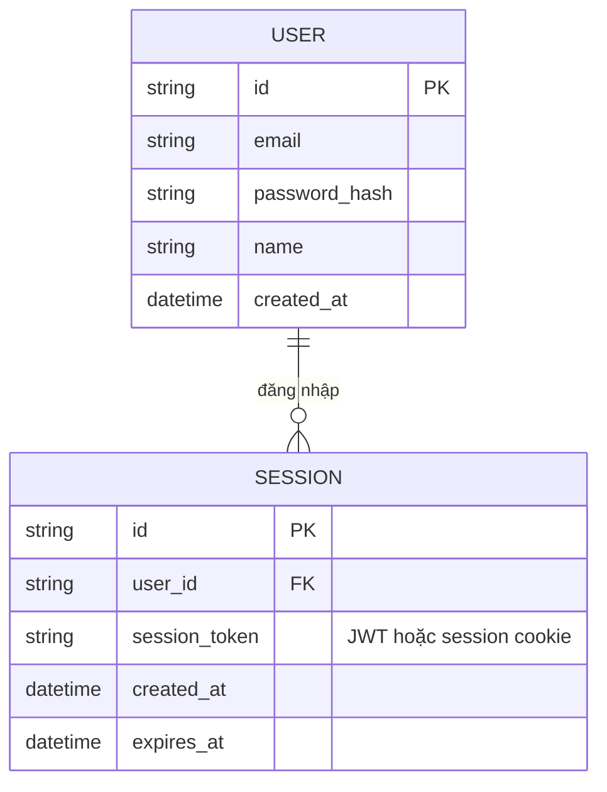

# Base ERD — Dashboard nội bộ chỉ có login email/password

Đây là **base**: mô hình dữ liệu suy luận từ ngữ cảnh đề bài. Đề bài nói rõ hệ thống "hiện chỉ có đăng nhập bằng email/password" — nên base chỉ cần entity xoay quanh User + session đăng nhập truyền thống, không bịa thêm các entity khác của dashboard quản lý task (board, card...) vì đề bài không liên quan tới chúng. Base **chưa có** khái niệm OAuth identity liên kết Google, chưa có state chống CSRF, chưa có logic giới hạn theo domain công ty — tất cả là phần enhance.

