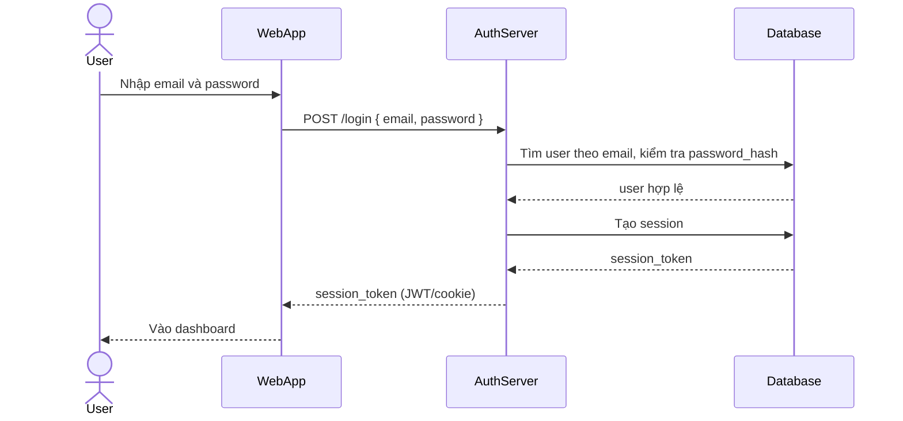

# Base sequence — Login

Đây là **base**, flow "Đăng nhập bằng email/password" — tiền đề bắt buộc cho enhance, vì "Sign in with Google" được thêm để thay thế/song song với chính flow này. Chọn flow này để làm rõ cơ chế phát session token nội bộ đã có sẵn trước khi có thêm phương thức đăng nhập qua Google.

