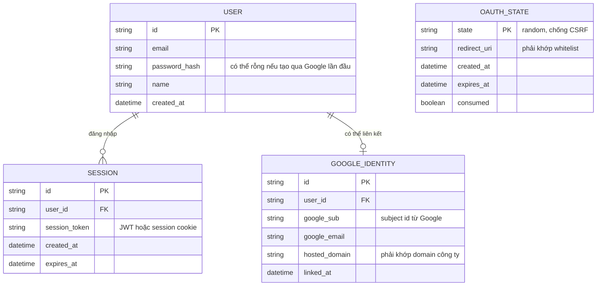

# Enhance ERD — Thêm Sign in with Google với account linking và CSRF state

Đây là ERD **sau khi** enhance được áp dụng lên base. `USER` và `SESSION` giữ nguyên. So với base, có 2 nhóm entity mới, ứng trực tiếp với yêu cầu trong đề bài:

- `GOOGLE_IDENTITY` (mới) — liên kết 1 user với 1 Google account (`google_sub`, `hosted_domain` để kiểm tra domain công ty), cho phép map với user cũ nếu email đã tồn tại (account linking).
- `OAUTH_STATE` (mới) — lưu tạm `state` param để chống CSRF và `redirect_uri` cần khớp whitelist, tồn tại ngắn hạn trong lúc chờ Google redirect trở lại.

Access token của Google **không** được lưu thành entity nào cả — đúng yêu cầu đề bài "chỉ dùng một lần để lấy profile, không lưu lại".

