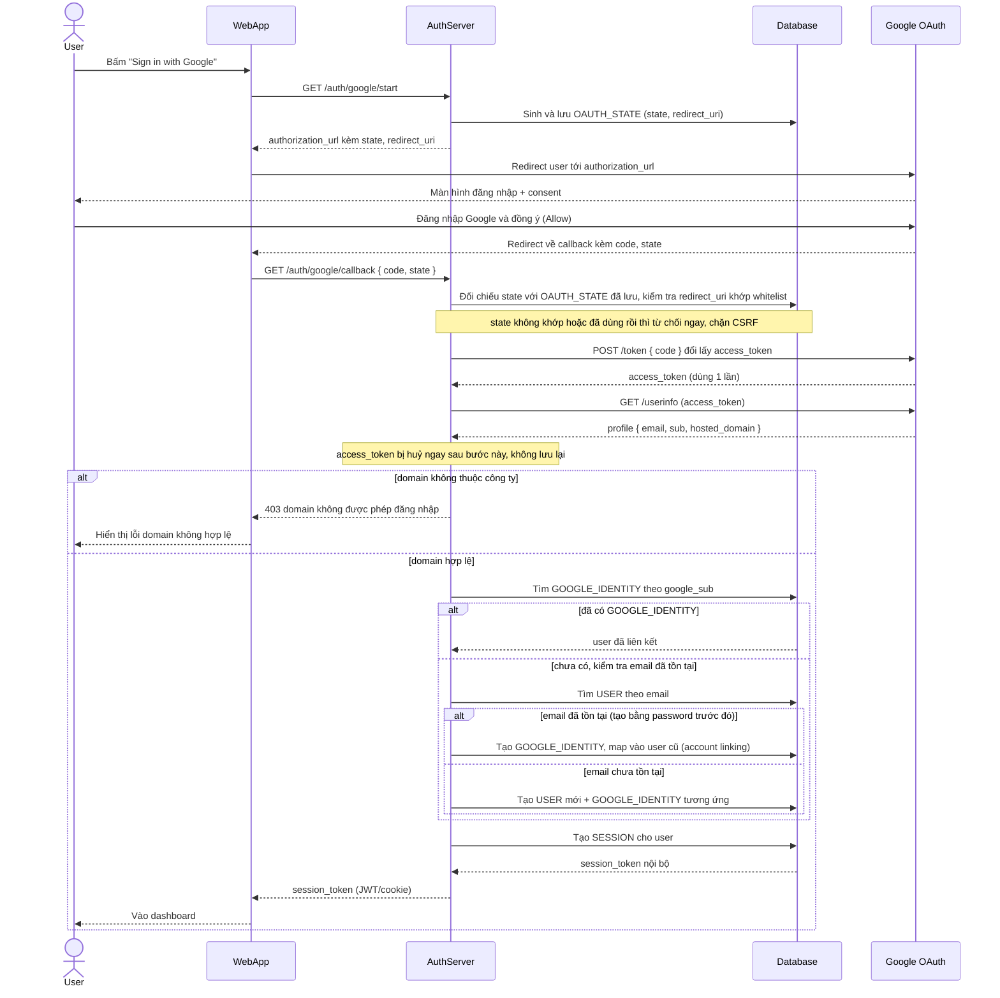

# Enhance sequence — Google login

Đây là **enhance**, flow hoàn toàn mới so với base — đăng nhập qua "Sign in with Google" bằng authorization code flow. Đây là flow trung tâm của enhance, thể hiện state chống CSRF + validate redirect_uri, giới hạn theo domain công ty, account linking khi email đã tồn tại, và việc access token của Google chỉ dùng 1 lần rồi không lưu lại.

